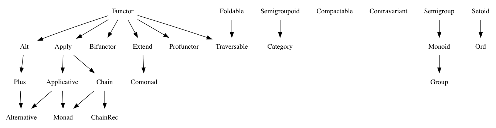

# Fantasy Land Specification

[](https://gitter.im/fantasyland/fantasy-land?utm_source=badge&utm_medium=badge&utm_campaign=pr-badge&utm_content=badge)

(aka "Algebraic JavaScript Specification")


This project specifies interoperability of common algebraic
structures:

* [Setoid](#setoid)
* [Semigroup](#semigroup)
* [Monoid](#monoid)
* [Functor](#functor)
* [Apply](#apply)
* [Applicative](#applicative)
* [Foldable](#foldable)
* [Traversable](#traversable)
* [Chain](#chain)
* [Monad](#monad)
* [Extend](#extend)
* [Comonad](#comonad)



## General

An algebra is a set of values, a set of operators that it is closed
under and some laws it must obey.

Each Fantasy Land algebra is a separate specification. An algebra may
have dependencies on other algebras which must be implemented. An
algebra may also state other algebra methods which do not need to be
implemented and how they can be derived from new methods.

## Terminology

1. "value" is any JavaScript value, including any which have the
   structures defined below.
2. "equivalent" is an appropriate definition of equivalence for the given value.
    The definition should ensure that the two values can be safely swapped out in a program that respects abstractions. For example:
    - Two lists are equivalent if they are equivalent at all indices.
    - Two plain old JavaScript objects, interpreted as dictionaries, are equivalent when they are equivalent for all keys.
    - Two promises are equivalent when they yield equivalent values.
    - Two functions are equivalent if they yield equivalent outputs for equivalent inputs.

## How to add Fantasy Land compatibility to your library

1. Add `fantasy-land` package as a peer dependency. Add in your `package.json`:

  ```js
  {
    ...
    "peerDependencies": {
      "fantasy-land": "*"
    },
    ...
  }
  ```

2. The `fantasy-land` package exposes method names, you should use them for you Fantasy Land methods:

  ```js
  var fl = require('fantasy-land')

  // ...

  MyType.prototype[fl.map] = function(fn) {
    // Here goes implementation of map for your type...
  }
  ```

## How to use Fantasy Land compatible library in your application

1. Add library npm package, and `fantasy-land` as your normal dependecies:

  ```js
  {
    ...
    "dependencies": {
      "some-fl-compatible-lib": "1.0.0",
      "fantasy-land": "1.0.0"
    },
    ...
  }
  ```

2. If you don't want to access Fantasy Land methods directly
  (for example if you use two libraries that talk to each other using Fantasy Land),
  then that's it — simply install them and use as you normally would,
  only install `fantasy-land` package as well.

  If you do want to access Fantasy Land methods, do it like this:

  ```js
  var fl = require('fantasy-land')
  var Something = require('some-fl-compatible-lib')

  var foo = new Something(1)
  var bar = foo[fl.map](x => x + 1)
  ```


## Algebras

### Setoid

1. `a.equals(a) === true` (reflexivity)
2. `a.equals(b) === b.equals(a)` (symmetry)
3. If `a.equals(b)` and `b.equals(c)`, then `a.equals(c)` (transitivity)

#### `equals` method

A value which has a Setoid must provide an `equals` method. The
`equals` method takes one argument:

    a.equals(b)

1. `b` must be a value of the same Setoid

    1. If `b` is not the same Setoid, behaviour of `equals` is
       unspecified (returning `false` is recommended).

2. `equals` must return a boolean (`true` or `false`).

### Semigroup

1. `a.concat(b).concat(c)` is equivalent to `a.concat(b.concat(c))` (associativity)

#### `concat` method

A value which has a Semigroup must provide a `concat` method. The
`concat` method takes one argument:

    s.concat(b)

1. `b` must be a value of the same Semigroup

    1. If `b` is not the same semigroup, behaviour of `concat` is
       unspecified.

2. `concat` must return a value of the same Semigroup.

### Monoid

A value that implements the Monoid specification must also implement
the Semigroup specification.

1. `m.concat(m.empty())` is equivalent to `m` (right identity)
2. `m.empty().concat(m)` is equivalent to `m` (left identity)

#### `empty` method

A value which has a Monoid must provide an `empty` method on itself or
its `constructor` object. The `empty` method takes no arguments:

    m.empty()
    m.constructor.empty()

1. `empty` must return a value of the same Monoid

### Functor

1. `u.map(a => a)` is equivalent to `u` (identity)
2. `u.map(x => f(g(x)))` is equivalent to `u.map(g).map(f)` (composition)

#### `map` method

A value which has a Functor must provide a `map` method. The `map`
method takes one argument:

    u.map(f)

1. `f` must be a function,

    1. If `f` is not a function, the behaviour of `map` is
       unspecified.
    2. `f` can return any value.

2. `map` must return a value of the same Functor

### Apply

A value that implements the Apply specification must also
implement the Functor specification.

1. `a.map(f => g => x => f(g(x))).ap(u).ap(v)` is equivalent to `a.ap(u.ap(v))` (composition)

#### `ap` method

A value which has an Apply must provide an `ap` method. The `ap`
method takes one argument:

    a.ap(b)

1. `a` must be an Apply of a function,

    1. If `a` does not represent a function, the behaviour of `ap` is
       unspecified.

2. `b` must be an Apply of any value

3. `ap` must apply the function in Apply `a` to the value in
   Apply `b`

### Applicative

A value that implements the Applicative specification must also
implement the Apply specification.

A value which satisfies the specification of an Applicative does not
need to implement:

* Functor's `map`; derivable as `function(f) { return this.of(f).ap(this); }`

1. `a.of(x => x).ap(v)` is equivalent to `v` (identity)
2. `a.of(f).ap(a.of(x))` is equivalent to `a.of(f(x))` (homomorphism)
3. `u.ap(a.of(y))` is equivalent to `a.of(f => f(y)).ap(u)` (interchange)

#### `of` method

A value which has an Applicative must provide an `of` method on itself
or its `constructor` object. The `of` method takes one argument:

    a.of(b)
    a.constructor.of(b)

1. `of` must provide a value of the same Applicative

    1. No parts of `b` should be checked

### Foldable

1. `u.reduce` is equivalent to `u.toArray().reduce`

* `toArray`; derivable as `function() { return this.reduce((acc, x) => acc.concat([x]), []); }`

#### `reduce` method

A value which has a Foldable must provide a `reduce` method. The `reduce`
method takes two arguments:

    u.reduce(f, x)

1. `f` must be a binary function

    1. if `f` is not a function, the behaviour of `reduce` is unspecified.
    2. The first argument to `f` must be the same type as `x`.
    3. `f` must return a value of the same type as `x`

1. `x` is the initial accumulator value for the reduction

### Traversable

A value that implements the Traversable specification must also
implement the Functor specification.

1. `t(u.sequence(f.of))` is equivalent to `u.map(t).sequence(g.of)`
for any `t` such that `t(x).map(a)` is equivalent to `t(x.map(a))` (naturality)

2. `u.map(F.of).sequence(F.of)` is equivalent to `F.of(u)` for any Applicative `F` (identity)

3. `u.map(Compose.of).sequence(Compose.of)` is equivalent to
   `Compose.of(u.sequence(f.of).map(x => x.sequence(g.of)))` for Compose type defined below (composition)

```js
var Compose = function(c) {
  this.c = c;
};

Compose.of = function(c) {
  return new Compose(c);
};

Compose.prototype.ap = function(x) {
  return Compose.of(this.c.map(u => y => u.ap(y)).ap(x.c));
};

Compose.prototype.map = function(f) {
  return Compose.of(this.c.map(y => y.map(f)));
};
```

* `traverse`; derivable as `function(f, of) { return this.map(f).sequence(of); }`

#### `sequence` method

A value which has a Traversable must provide a `sequence` method. The `sequence`
method takes one argument:

    u.sequence(of)

1. `of` must return the Applicative that `u` contains.

### Chain

A value that implements the Chain specification must also
implement the Apply specification.

A value which satisfies the specification of a Chain does not
need to implement:

* Apply's `ap`; derivable as `function ap(m) { return this.chain(f => m.map(f)); }`

1. `m.chain(f).chain(g)` is equivalent to `m.chain(x => f(x).chain(g))` (associativity)

#### `chain` method

A value which has a Chain must provide a `chain` method. The `chain`
method takes one argument:

    m.chain(f)

1. `f` must be a function which returns a value

    1. If `f` is not a function, the behaviour of `chain` is
       unspecified.
    2. `f` must return a value of the same Chain

2. `chain` must return a value of the same Chain

### Monad

A value that implements the Monad specification must also implement
the Applicative and Chain specifications.

A value which satisfies the specification of a Monad does not need to
implement:

* Apply's `ap`; derivable as `function(m) { return this.chain(f => m.map(f)); }`
* Functor's `map`; derivable as `function(f) { var m = this; return m.chain(a => m.of(f(a)))}`

1. `m.of(a).chain(f)` is equivalent to `f(a)` (left identity)
2. `m.chain(m.of)` is equivalent to `m` (right identity)

### Extend

1. `w.extend(g).extend(f)` is equivalent to `w.extend(_w => f(_w.extend(g)))`

#### `extend` method

An Extend must provide an `extend` method. The `extend`
method takes one argument:

     w.extend(f)

1. `f` must be a function which returns a value

    1. If `f` is not a function, the behaviour of `extend` is
       unspecified.
    2. `f` must return a value of type `v`, for some variable `v` contained in `w`.

2. `extend` must return a value of the same Extend.

### Comonad

A value that implements the Comonad specification must also implement the Functor and Extend specifications.

1. `w.extend(_w => _w.extract())` is equivalent to `w`
2. `w.extend(f).extract()` is equivalent to `f(w)`
3. `w.extend(f)` is equivalent to `w.extend(x => x).map(f)`

#### `extract` method

A value which has a Comonad must provide an `extract` method on itself.
The `extract` method takes no arguments:

    c.extract()

1. `extract` must return a value of type `v`, for some variable `v` contained in `w`.
    1. `v` must have the same type that `f` returns in `extend`.


## Notes

1. If there's more than a single way to implement the methods and
   laws, the implementation should choose one and provide wrappers for
   other uses.
2. It's discouraged to overload the specified methods. It can easily
   result in broken and buggy behaviour.
3. It is recommended to throw an exception on unspecified behaviour.
4. An `Id` container which implements all methods is provided in
   `id.js`.
