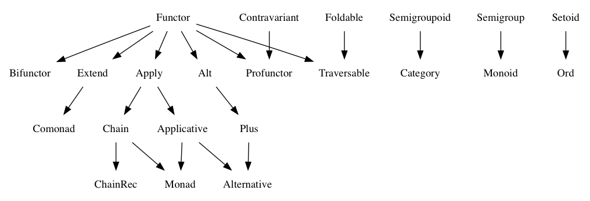

# Fantasy Land Specification


## Module

A module is a JavaScript object with some static functions and/or values, "static" meaning they don't use `this`.

Here is an example:

```js
const FooModule = {
  foo: 1,            // a value
  bar: (x) => x + 1, // a function
}
```

Note that this has nothing to do with JavaScript module systems like ES6 modules, in this specification, a module is just an object.


## Module Signature

Module signature describes an interface that a module may match. The syntax is very similar to that of Flow or TypeScript. Here is an example of a signature that the `FooModule` above matches:

```js
Foo {
  foo: number,
  bar: (number) => number
}
```

Note that we omit argument names in function types. In TypeScript or Flow `(number) => number` is usually written as `(a: number) => number`. We omit that for brevity.

A signature can be parameterized by a type, which looks like this:

```js
ParameterizedFoo<T> {
  foo: T,
  bar: (T) => T
}
```

A module matches a parameterized signature if there is some concrete type such that if we substitute all occurrences of type argument `T` in the signature with that type, the module will match the resulting signature. For example, if we substitute `T` in `ParameterizedFoo` with `number` we get a signature that `FooModule` matches, therefore `FooModule` matches `ParameterizedFoo` for `number`.

Also, functions in a signature may have type variables. These variables are specified in `<>` at the beginning of a function type. For instance:

```js
Bar<T> {
  baz: <a>(a) => T<a>
}
```

Notice that the module level type argument `T` can be parameterized as well. The number of type variables of `T` becomes unambiguous when `T` is used inside the signature.

Also, notice that module level type variables are fixed for a module, while a function level variable can be substituted with a different concrete type in each function application. In other words, in the above example, we must choose what `T` stands for when we create a module, and we must choose what `a` stands for only when we apply `baz` to some value.

A module signature may be a part of another module signature, which means that we should pass a module that matches that signature in that place. For example:

```js
Baz {
  compute: <a>(a, ParameterizedFoo<a>) => a
}
```

The above means that when we apply `compute` to say `number` we must pass as the second argument a module that matches `ParameterizedFoo` with `T = number`, like so:

```js
someBaz.compute(10, FooModule)
```


## Equivalence

An appropriate definition of equivalence for the given value should ensure that the two values can be safely swapped out in a program that respects abstractions.

For example:

 - Two lists are equivalent if they are equivalent at all indices.
 - Two plain old JavaScript objects, interpreted as dictionaries,
   are equivalent when they are equivalent for all keys.
 - Two promises are equivalent when they yield equivalent values.
 - Two functions are equivalent if they yield equivalent outputs for equivalent inputs.

Note that these examples are not universal, in some cases different definitions of equivalence for that types might be more appropriate. It depends on which exact abstractions you choose to use in a program.

We use `≡` symbol to denote equivalence.


## Parametricity

All methods' implementations should only use type information about arguments that is known from the signatures. It's not allowed to inspect arguments or values that they produce or contain to get more information about their types. In other words, methods should be [parametrically polymorphic](https://en.wikipedia.org/wiki/Parametric_polymorphism).


## Canonical Module

A value may have a reference to a canonical module that works with values of that value's type. The reference should be in the `fantasy-land/canonical` property. For example:

```js
const ListModule = {
  of(x) {
    return {'fantasy-land/canonical': ListModule, data: [x]}
  },
  map(f, v) {
    return {'fantasy-land/canonical': ListModule, data: v.data.map(f)}
  }
}
```

In case a value has a reference to a canonical module, that module must produce values with references to itself. In the following example, `list` is an incorrect value, because `ListModule2` does not produce values with references to itself:

```js
const ListModule2 = {
  of(x) {
    return {data: [x]}
  },
  map(f, v) {
    return {data: v.data.map(f)}
  }
}

const list = {'fantasy-land/canonical': ListModule2, data: [1]}
```

Note that the `ListModule2` here is correct. Only the `list` value doesn't follow the specification.


## Algebra

Algebra is a set of requirements for modules, like to match a signature and to obey some laws. If a module satisfies all requirements of an algebra it supports that algebra. An algebra may require supporting other algebras.

An algebra may also state other algebra methods which can be derived from new methods. If a module provides a method which could be derived, its behavior must be equivalent to that of the derivation (or derivations).

* [Setoid](#setoid)
* [Ord](#ord)
* [Semigroup](#semigroup)
* [Monoid](#monoid)
* [Group](#group)
* [Semigroupoid](#semigroupoid)
* [Category](#category)
* [Filterable](#filterable)
* [Functor](#functor)
* [Bifunctor](#bifunctor)
* [Contravariant](#contravariant)
* [Profunctor](#profunctor)
* [Apply](#apply)
* [Applicative](#applicative)
* [Alt](#alt)
* [Plus](#plus)
* [Alternative](#alternative)
* [Chain](#chain)
* [ChainRec](#chainrec)
* [Monad](#monad)
* [Foldable](#foldable)
* [Extend](#extend)
* [Comonad](#comonad)
* [Traversable](#traversable)




### Setoid

```js
Setoid<T> {
  equals: (T, T) => boolean
}
```

Module must match the `Setoid` signature for some type `T`, and obey following laws:

  1. Reflexivity: `S.equals(a, a) === true`
  1. Symmetry: `S.equals(a, b) === S.equals(b, a)`
  1. Transitivity: if `S.equals(a, b)` and `S.equals(b, c)`, then `S.equals(a, c)`


### Ord

```js
Ord<T> {
  lte: (T, T) => boolean
}
```

Module must match the `Ord` signature for some type `T`, support `Setoid` algebra for the same `T`, and obey following laws:

  1. Totality: `S.lte(a, b)` or `S.lte(b, a)`
  1. Antisymmetry: if `S.lte(a, b)` and `S.lte(b, a)`, then `S.equals(a, b)`
  1. Transitivity: if `S.lte(a, b)` and `S.lte(b, c)`, then `S.lte(a, c)`


### Semigroup

```js
Semigroup<T> {
  concat: (T, T) => T
}
```

Module must match the `Semigroup` signature for some type `T`, and obey following laws:

  1. Associativity: `S.concat(S.concat(a, b), c) ≡ S.concat(a, S.concat(b, c))`


### Monoid

```js
Monoid<T> {
  empty: () => T
}
```

Module must match the `Monoid` signature for some type `T`, support `Semigroup` algebra for the same `T`, and obey following laws:

  1. Right identity: `M.concat(a, M.empty()) ≡ a`
  1. Left identity: `M.concat(M.empty(), a) ≡ a`


### Group

```js
Group<T> {
  invert: (T) => T
}
```

Module must match the `Group` signature for some type `T`, support `Monoid` algebra for the same `T`, and obey following laws:

  1. Right inverse: `G.concat(a, G.invert(a)) ≡ G.empty()`
  1. Left inverse: `G.concat(G.invert(a), a) ≡ G.empty()`


### Semigroupoid

```js
Semigroup<T> {
  compose: <i, j, k>(T<i, j>, T<j, k>) => T<i, k>
}
```

Module must match the `Semigroupoid` signature for some type `T`, and obey following laws:

  1. Associativity: `S.compose(S.compose(a, b), c) ≡ S.compose(a, S.compose(b, c))`


### Category

```js
Category<T> {
  id: <i, j>() => T<i, j>
}
```

Module must match the `Category` signature for some type `T`, support `Semigroupoid` algebra for the same `T`, and obey following laws:

  1. Right identity: `M.compose(a, M.id()) ≡ a`
  1. Left identity: `M.compose(M.id(), a) ≡ a`


### Filterable

```js
Filterable<T> {
  filter: <a>(a => boolean, T<a>) => T<a>
}
```

Module must match the `Filterable` signature for some type `T`, and obey following laws:

  1. Distributivity: `F.filter(x => f(x) && g(x), a) ≡ F.filter(g, F.filter(f, a))`
  1. Identity: `F.filter(x => true, a) ≡ a`
  1. Annihilation: `F.filter(x => false, a) ≡ F.filter(x => false, b)`


### Functor

```js
Functor<T> {
  map: <a, b>(a => b, T<a>) => T<b>
}
```

Module must match the `Functor` signature for some type `T`, and obey following laws:

  1. Identity: `F.map(x => x, a) ≡ a`
  1. Composition: `F.map(x => f(g(x)), a) ≡ F.map(f, F.map(g, a))`


### Bifunctor

```js
Bifunctor<T> {
  bimap: <a, b, c, d>(a => b, c => d, T<a, c>) => T<b, d>
}
```

Module must match the `Bifunctor` signature for some type `T`, support `Functor` algebra for all types `U` created by setting the first parameter of `T` to an arbitrary concrete type (for example `U<a> = T<number, a>`), and obey following laws:

  1. Identity: `B.bimap(x => x, x => x, a) ≡ a`
  1. Composition: `B.bimap(x => f(g(x)), x => h(i(x)), a) ≡ B.bimap(f, h, B.bimap(g, i, a))`

#### Can be derived

  1. Functor's map: `A.map = (f, u) => A.bimap(x => x, f, u)`


### Contravariant

```js
Contravariant<T> {
  contramap: <a, b>(a => b, T<b>) => T<a>
}
```

Module must match the `Contravariant` signature for some type `T`, and obey following laws:

  1. Identity: `F.contramap(x => x, a) ≡ a`
  1. Composition: `F.contramap(x => f(g(x)), a) ≡ F.contramap(g, F.contramap(f, a))`


### Profunctor

```js
Profunctor<T> {
  promap: <a, b, c, d>(a => b, c => d, T<b, c>) => T<a, d>
}
```

Module must match the `Profunctor` signature for some type `T`, support `Functor` algebra for all types `U` created by setting the first parameter of `T` to an arbitrary concrete type (for example `U<a> = T<number, a>`), and obey following laws:

  1. Identity: `P.promap(x => x, x => x, a) ≡ a`
  1. Composition: `P.promap(x => f(g(x)), x => h(i(x)), a) ≡ P.promap(g, h, P.promap(f, i, a))`

#### Can be derived

  1. Functor's map: `A.map = (f, u) => A.promap(x => x, f, u)`


### Apply

```js
Apply<T> {
  ap: <a, b>(T<a => b>, T<a>) => T<b>
}
```

Module must match the `Apply` signature for some type `T`, support `Functor` algebra for the same `T`, and obey following laws:

  1. Composition: `A.ap(A.ap(A.map(f => g => x => f(g(x)), a), u), v) ≡ A.ap(a, A.ap(u, v))`


### Applicative

```js
Applicative<T> {
  of: <a>(a) => T<a>
}
```

Module must match the `Applicative` signature for some type `T`, support `Apply` algebra for the same `T`, and obey following laws:

  1. Identity: `A.ap(A.of(x => x), v) ≡ v`
  1. Homomorphism: `A.ap(A.of(f), A.of(x)) ≡ A.of(f(x))`
  1. Interchange: `A.ap(u, A.of(y)) ≡ A.ap(A.of(f => f(y)), u)`

#### Can be derived

  1. Functor's map: `A.map = (f, u) => A.ap(A.of(f), u)`


### Alt

```js
Alt<T> {
  alt: <a>(T<a>, T<a>) => T<a>
}
```

Module must match the `Alt` signature for some type `T`, support `Functor` algebra for the same `T`, and obey following laws:

  1. Associativity: `A.alt(A.alt(a, b), c) ≡ A.alt(a, A.alt(b, c))`
  2. Distributivity: `A.map(f, A.alt(a, b)) ≡ A.alt(A.map(f, a), A.map(f, b))`


### Plus

```js
Plus<T> {
  zero: <a>() => T<a>
}
```

Module must match the `Plus` signature for some type `T`, support `Alt` algebra for the same `T`, and obey following laws:

  1. Right identity: `P.alt(a, P.zero()) ≡ a`
  2. Left identity: `P.alt(P.zero(), a) ≡ a`
  3. Annihilation: `P.map(f, P.zero()) ≡ P.zero()`


### Alternative

Module must support `Applicative` and `Plus` algebras for a same `T`, and obey following laws:

  1. Distributivity: `A.ap(A.alt(a, b), c) ≡ A.alt(A.ap(a, c), A.ap(b, c))`
  2. Annihilation: `A.ap(A.zero(), a) ≡ A.zero()`


### Chain

```js
Chain<T> {
  chain: <a, b>(a => T<b>, T<a>) => T<b>
}
```

Module must match the `Chain` signature for some type `T`, support `Apply` algebra for the same `T`, and obey following laws:

  1. Associativity: `M.chain(g, M.chain(f, u)) ≡ M.chain(x => M.chain(g, f(x)), u)`

#### Can be derived

  1. Apply's ap: `A.ap = (uf, ux) => A.chain(f => A.map(f, ux), uf)`


### ChainRec

```js
ChainRec<T> {
  chainRec: <a, b>((a => Next<a>, b => Done<b>, a) => T<Next<a> | Done<b>>, a) => T<b>
}
```

Module must match the `ChainRec` signature for some type `T`, support `Chain` algebra for the same `T`, and obey following laws:

  1. Equivalence: `C.chainRec((next, done, v) => p(v) ? C.map(done, d(v)) : C.map(next, n(v)), i) ≡ (function step(v) { return p(v) ? d(v) : C.chain(step, n(v)) }(i))`
  2. Stack usage of `C.chainRec(f, i)` must be at most a constant multiple of the stack usage of `f` itself.


### Monad

Module must support `Applicative` and `Chain` algebras for a same `T`, and obey following laws:

  1. Left identity: `M.chain(f, M.of(a)) ≡ f(a)`
  1. Right identity: `M.chain(M.of, u) ≡ u`

#### Can be derived

  1. Functor's map: `A.map = (f, u) => A.chain(x => A.of(f(x)), u)`


### Foldable

```js
Foldable<T> {
  reduce: <a, b>((a, b) => a, a, T<b>) => a
}
```

Module must match the `Foldable` signature for some type `T`, and obey following laws:

  1. `F.reduce ≡ (f, x, u) => F.reduce((acc, y) => acc.concat([y]), [], u).reduce(f, x)`


### Extend

```js
Extend<T> {
  extend: <a, b>(T<a> => b, T<a>) => T<b>
}
```

Module must match the `Extend` signature for some type `T`, support `Functor` algebra for the same `T`, and obey following laws:

  1. Associativity: `E.extend(f, E.extend(g, w)) ≡ E.extend(_w => f(E.extend(g, _w)), w)`


### Comonad

```js
Comonad<T> {
  extract: <a>(T<a>) => a
}
```

Module must match the `Comonad` signature for some type `T`, support `Extend` algebra for the same `T`, and obey following laws:

#### Laws

  1. Left identity: `C.extend(C.extract, w) ≡ w`
  1. Right identity: `C.extract(C.extend(f, w)) ≡ f(w)`


### Traversable

In the following signature `Applicative<U>` stands for a module that not only matches the `Applicative` signature but also supports the Applicative algebra.

```js
Traversable<T> {
  traverse: <U, a, b>(Applicative<U>, a => U<b>, T<a>) => U<T<b>>
}
```

Module must match the `Traversable` signature for some type `T`, support `Functor` and `Foldable` algebras for the same `T`, and obey following laws:

  1. Naturality: `f(T.traverse(A, x => x, u)) ≡ T.traverse(B, f, u)` for any `f` such that `B.map(g, f(a)) ≡ f(A.map(g, a))`
  2. Identity: `T.traverse(F, F.of, u) ≡ F.of(u)` for any Applicative `F`
  3. Composition: `T.traverse(Compose(A, B), x => x, u) ≡ A.map(v => T.traverse(B, x => x, v), T.traverse(A, x => x, u))` for `Compose` defined bellow and for any Applicatives `A` and `B`

```js
function Compose(A, B) {
  return {

    of(x) {
      return A.of(B.of(x))
    },

    ap(a1, a2) {
      return A.ap(A.map(b1 => b2 => B.ap(b1, b2), a1), a2)
    },

    map(f, a) {
      return A.map(b => B.map(f, b), a)
    },

  }
}
```

#### Can be derived

  1. Foldable's reduce:

  ```js
  F.reduce = (f, acc, u) => {
    const of = () => acc
    const map = (_, x) => x
    const ap = f
    return F.traverse({of, map, ap}, x => x, u)
  }
  ```

  2. Functor's map:

  ```js
  F.map = (f, u) => {
    const of = (x) => x
    const map = (f, a) => f(a)
    const ap = (f, a) => f(a)
    return F.traverse({of, map, ap}, f, u)
  }
  ```
